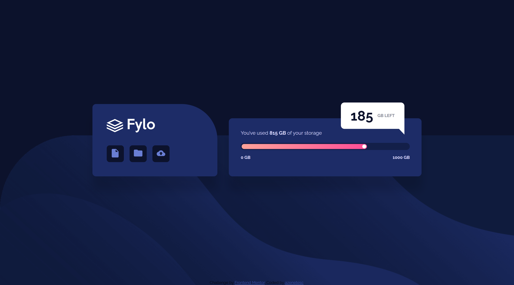

# Frontend Mentor - Fylo data storage component solution

This is a solution to the [Fylo data storage component challenge on Frontend Mentor](https://www.frontendmentor.io/challenges/fylo-data-storage-component-1dZPRbV5n).

## Table of contents

- [Overview](#overview)
  - [Screenshot](#screenshot)
  - [Links](#links)
- [My process](#my-process)
  - [Built with](#built-with)
  - [Useful resources](#useful-resources)
- [Author](#author)

## Overview

### Screenshot

  <h3>My solution</h3> 

### Links

- Solution URL: [FrontEnd Mentor: My Solution](https://github.com/azenetesc/fylo-data-storage)
- Live Site URL: [GitHub Page: Fylo data storage](https://azenetesc.github.io/fylo-data-storage/)

## My process

### Built with

- Semantic HTML5 markup
- SASS
- Flexbox
- Mobile-first workflow

### Useful resources

- [CSS-Tricks: The Shape of CSS](https://css-tricks.com/the-shapes-of-css/) - This helped me with the shape for the dialog box.
- [CSS-Tricks: A Guide For flexbox](https://css-tricks.com/snippets/css/a-guide-to-flexbox/) - This helped me with flexbox. It's a really cool guide, and explains everything with visual examples.

## Author

- Frontend Mentor - [@azenetesc](https://www.frontendmentor.io/profile/azenetesc)
